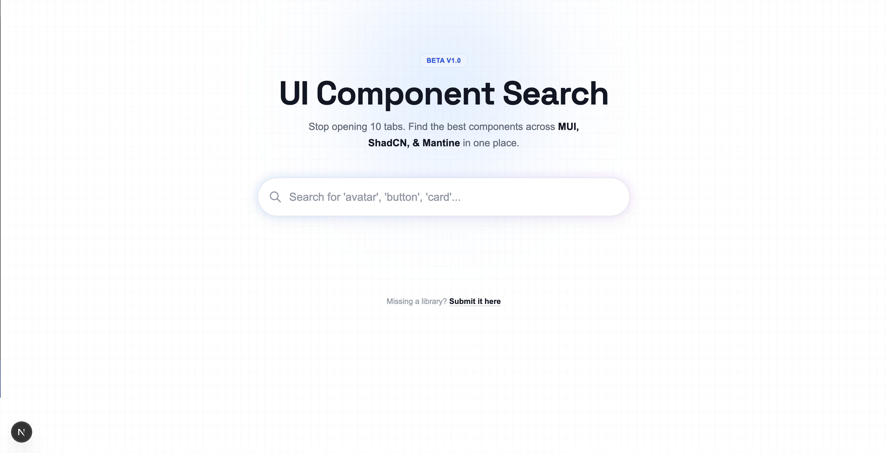

# 🎨 UI Component Search Engine

A "Google-like" search engine for React UI components.
It indexes documentation from major libraries (Material UI, ShadCN, Mantine, Radix, AntD) so developers can find, compare, and copy components in seconds without opening 10 tabs.


## ✨ Features

- **⚡️ Instant Search:** fuzzy search across 500+ components.
- **🧠 Smart Indexing:** Searches by name, library, framework, or synonym keywords (e.g., "Toast" finds "Snackbar").
- **🔥 Popularity System:** Highlights trending libraries with a "Hot" badge.
- **🛡 Admin Dashboard:** Review and approve user-submitted libraries.
- **🤖 Automated Scrapers:** Includes scripts to auto-generate database entries.

## 🛠 Tech Stack

- **Frontend:** Next.js 14 (App Router), Tailwind CSS
- **Backend:** Next.js API Routes (Serverless)
- **Database:** MongoDB (Mongoose)
- **Tools:** Cheerio (Scraping), XML2JS (Sitemap Parsing)

---

## 🚀 Getting Started

### 1. Clone the repo
```bash
git clone https://github.com/YOUR_USERNAME/ui-search-engine.git
cd ui-search-engine
```

### 2. Install dependencies
```bash
npm install
```

### 3. Setup Environment Variables
Create a `.env` file in the root directory:
```env
MONGODB_URI=mongodb+srv://<user>:<password>@cluster0.mongodb.net/ui-search-engine
```

### 4. Seed the Database (Crucial Step)
This project uses a **scripts folder** to manage data. You must populate your local database before the app will work.

**Option A: The Generator (Fastest & Recommended)**
Instantly generates 300+ valid component links using URL patterns. No network required.
```bash
node scripts/seed-generator.js
```

**Option B: The Scraper (Advanced)**
Crawls real documentation sites to find new components.
```bash
node scripts/sitemap-scraper.js
```

### 5. Run the App
```bash
npm run dev
```
Open [http://localhost:3000](http://localhost:3000) with your browser.

---

## 📂 Project Structure

```bash
/app             # Next.js App Router (Pages & API)
  /api           # Backend Endpoints (Search, Submit, Admin)
/components      # React UI Components
/lib             # Database connection helper
/models          # Mongoose Schemas (Component, Submission)
/scripts         # 🛠 Utilities for database management
  ├── seed-generator.js   # Generates mock data offline
  ├── sitemap-scraper.js  # Crawls live sitemaps
  └── scraper.js          # Manual HTML scraping
```

## 🤝 Contributing

1. Fork the Project
2. Create your Feature Branch (`git checkout -b feature/AmazingFeature`)
3. Commit your Changes (`git commit -m 'Add some AmazingFeature'`)
4. Push to the Branch (`git push origin feature/AmazingFeature`)
5. Open a Pull Request